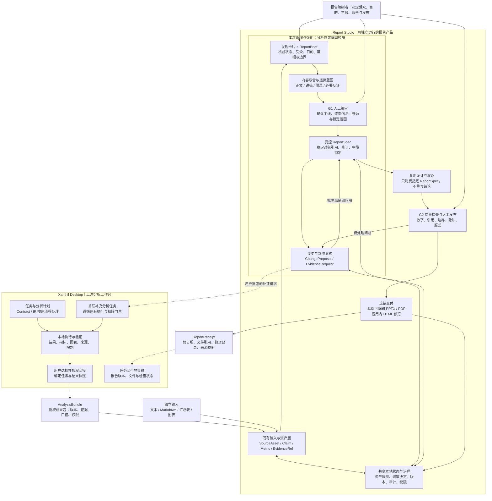

# Report Studio｜分析成果编审模块

## 模块级产品方案 v1.0

| 文档项 | 内容 |
|---|---|
| 文档日期 | 2026-09-23 |
| 所属产品 | Report Studio |
| 模块名称 | 分析成果编审模块；内部工作名可使用 Editorial Workbench |
| 上游结合对象 | Xanthil Desktop 的数据分析流程；同时支持独立材料导入 |
| 文档性质 | 模块级增量产品方案，供产品与开发 Controller 拆解；不代表功能已实现 |
| 交付边界 | 本次规划内容编审及其接缝，不重写整个 Report Studio，也不重建 JuanerAI |
| 实现状态说明 | 已核对此前产品规划与本次需求，尚未核查两个产品的实际源码、接口及运行状态 |

> **产品主张：分析可以充分展开，汇报必须有所取舍。Agent 提供发现、证据与表达候选，编制者决定主线和内容取舍，系统把这些决定落实为可追溯、可锁定、可局部修改的报告。**

### 本稿的规范性边界

本模块属于 **Report Studio**，不是一个新的独立产品，也不是只能在 Xanthil Desktop 内运行的子页面。Xanthil Desktop 是优先结合的上游分析工作台；Report Studio 仍须能够通过普通材料导入独立完成编审和交付。[B1][B4]

首期复用 Report Studio 原方案中的基础可编辑 PPTX、PDF 定稿及应用内 HTML 预览。DOCX、可独立分发的 HTML 长报告等属于后续扩展，不能因为概念架构图画出了多种格式，就自动进入本模块首期验收。[B1]

**前序概念图中出现的不同日期、版本、模块名称、强依赖关系或扩大后的格式范围，不替代本稿定义。本文统一为 2026-09-23、模块方案 v1.0。** 图中的多个 Agent 只能理解为逻辑职责，首期不要求部署多个独立 Agent。

---

## 1. 产品结论

### 1.1 一句话定位

在“数据分析成果”与“正式对外报告”之间，建立由人掌握主线和取舍、由 Agent 辅助组织、由程序约束修改和发布的编审工作区。

它不只是摘要工具，也不是在全文生成后增加一次删减，而是改变报告形成的机制：

**分析工作记录 → 可引用的发现与证据 → 汇报任务书 → 内容取舍与逐页蓝图 → 人工确认 → 受控 ReportSpec → 局部生成与修改 → 检查、定稿和回执。**

### 1.2 要解决的核心矛盾

分析 Agent 的工作成果会随着探索不断增长，但一次汇报的受众、目的、篇幅和注意力是有限的。若直接把聊天内容或分析日志持续写进正式报告，就容易出现正文膨胀、主线漂移、已确认内容反复变化、重要限制被压缩掉等问题。

本模块将两项工作分开：

- **分析充分性：**应该探索和验证的内容，仍由分析侧完成，不因为报告只允许五页就停止必要验证。
- **表达适切性：**这一次向谁讲、要解决什么沟通问题、哪些内容进入正文，由汇报任务书和编审决定控制。

汇报任务书可以规定“需要回答什么”，不能预设“必须证明什么”。

### 1.3 最小产品闭环

用户在 Xanthil Desktop 完成一轮分析，选择经授权的发现、图表和证据版本，送入 Report Studio；系统推荐汇报主线与逐页蓝图，用户确认后生成报告。后续继续分析时，新增结果先进入候选区，不自动改写报告；需要补证时，以明确请求回到 Xanthil 的原有分析流程。最终文件和报告版本通过回执关联回原分析任务。

没有 Xanthil 时，用户导入已有 Markdown、汇总表和图表，仍能走完同一个编审闭环；补证请求可导出后由用户在其他分析工具处理。

---

## 2. 与既有 Report Studio 的关系

### 2.1 不是再造一套报告系统

既有 Report Studio 方案已经提出 ReportBrief、ReportSpec、Claim、EvidenceRef、来源资产、局部编辑、版本快照与发布检查。[B1] 本次是在这些对象和能力上增加编审规则与 Xanthil 接缝，而不是另建第二套事实库、页面库或导出引擎。

| 能力 | 既有规划基线 | 本模块的增量 |
|---|---|---|
| 材料输入 | 普通材料导入、来源索引 | 增加 Xanthil 授权分析成果包的映射与导入 |
| 内容与证据 | Claim、Metric、EvidenceRef、图表资产 | 将其呈现为发现卡片，区分证据状态与编排状态 |
| 汇报目标 | ReportBrief | 补充核心问题、非重点、正文预算、必要反证与分享边界 |
| 大纲 | 确认页序和页面主旨 | 增加取舍理由、逐页证据、必要风险、人工编审记录 |
| ReportSpec | 稳定页面与资产绑定 | 增加编审批准、字段锁定、作用范围、变更预条件 |
| 局部编辑 | 对象级修改、版本比较 | 以变更提案和确定性校验防止范围外改写 |
| 质量检查 | 数字、来源、措辞、排版、导出 | 增加重点覆盖、必要限制保留、已批准内容漂移检查 |
| 未来集成 | 上游结果输入、报告状态回传 | 明确 AnalysisBundle、EvidenceRequest、ReportReceipt 三条接缝 |

这里的“复用”是规划要求，不是对现有实现状态的确认。开发前需要核对哪些能力已经存在、哪些仍需补齐。

### 2.2 明确不属于本模块的工作

本模块不建设数据库问数、探索性分析、模型训练、深度研究或企业决策执行平台；不直接接管 Xanthil 的 Python 内核；不绕过原有权限去读取全部数据、聊天记录、四库或双库；不将报告发布当成业务策略批准；不将报告中的新判断自动写成长期知识。

不为编审单独引入图数据库、向量数据库、复杂多 Agent 团队或跨产品微服务平台。现阶段优先复用 Report Studio 的本地项目、资产、版本与存储能力。

---

## 3. 用户、场景与产品目标

### 3.1 目标用户

需要将数据分析转化为对外表达的业务分析与决策人员，包括专职分析师，以及运营、商品、营销、供应链、产品、门店、财务和经营管理等岗位。

“编制者”是一种当前任务角色，可以由完成分析的同一个人承担，不要求配置专门的编辑团队。

### 3.2 首期主场景

**已有分析成果 → 一次明确目的的会议汇报。**

优先验证零售经营复盘或专题行动评审：分析可能覆盖多个维度，但正式汇报只围绕一个明确问题，例如“是否批准重点门店补货试点”。

内部技术复盘、客户沟通和研究汇报可复用相同机制；复杂多人会签和长篇出版流程不作为首期前提。

### 3.3 产品目标

| 目标 | 用户能观察到的变化 |
|---|---|
| 重点可控 | 先看到主线、逐页核心信息和取舍理由，而不是直接面对一整篇长报告 |
| 内容稳定 | 继续分析或局部修改，不会未经授权重写已确认报告 |
| 证据可追溯 | 关键数字和判断可以定位到来源、结果版本、口径及验证记录 |
| 取舍不失真 | 简化表达时保留会改变判断的风险、反证和限制 |
| 衔接低摩擦 | 已有成果不需要复制粘贴重建；补证和最终交付均能关联回分析任务 |
| 独立价值保留 | 不启动 Xanthil，也能使用 Report Studio 完成同一编审流程 |

效率改善和采用率需要通过真实任务验证，不预先承诺节省比例或经营收益。

---

## 4. 人与 Agent 的职责

| 角色或组件 | 可以做 | 不可以做 |
|---|---|---|
| 分析 Agent／Xanthil 分析侧 | 执行获准分析、形成发现与验证记录、响应补证任务 | 因发现更新直接重写已批准报告；把报告表达批准当成分析结论通过 |
| 编审辅助 Agent | 整理发现、推荐重点、提出主线与逐页蓝图、解释取舍、起草局部变更 | 自行决定最终主线；删除影响判断的反证；越过锁定和权限修改对象 |
| 报告编制者 | 确定受众与目的、调整取舍、批准蓝图与变更、确认发布 | 通过一次点击把未验证推断变成已证实事实；绕过未授权数据外发限制 |
| 确定性编审控制器 | 校验版本、锁定、作用范围和引用；原子应用变更；记录批准 | 自行发明业务事实或替代人的实质判断 |
| 设计与渲染模块 | 消费指定版本的 ReportSpec，排版并生成文件 | 为填满页面而生成新业务结论；改动底层指标或证据 |
| 质量检查模块 | 检查数字、绑定、状态、范围、版式和隐私，提示语义风险 | 宣称有引用就一定真实，或宣称自动检查能保证所有结论正确 |

首期允许同一个模型按阶段承担编审辅助职责；任务阶段、可读取范围和写入权限由程序区分。**职责分离不等于必须多 Agent 部署。**

---

## 5. 与 Xanthil Desktop 数据分析流程的结合

### 5.1 原有分析主线保持不变

根据既有白皮书，Xanthil 的规划链路包括任务与用户确认、Analysis Contract、上下文解析与绑定、Analysis Plan IR、运行时执行、验证与溯源、结果展示，以及受控回流。[B2]

本模块不在上述链路中另加一个可以改写分析事实的中心。优先接入点是：

> **运行与验证形成了可识别的结果版本之后，由用户选择并授权交接分析成果。**

Analysis Contract／IR 的引用可帮助定位任务，但不是 Report Studio 编审核心的运行依赖。较轻量的 Xanthil 分析任务只要能提供成果、版本和权限边界，也可以接入。

### 5.2 三个结合时点

| 时点 | Xanthil 行为 | Report Studio 行为 | 默认边界 |
|---|---|---|---|
| 分析开始前 | 用户可表达未来汇报的受众、目的和篇幅 | 可预填 ReportBrief | 仅约束沟通目标，不预设分析结论，不缩减必要验证 |
| 多轮分析过程中 | 保存结果、指标、图表和验证记录；可按批次标记候选发现 | 接收用户授权的成果快照，更新候选区 | 不将完整聊天自动转换为正式报告，不自动改已确认页面 |
| 准备汇报时 | 选择成果范围和版本，发起“编制汇报” | 打开编审工作区，确认主线后形成报告 | 分析任务与报告项目分别保存，各有生命周期 |

首期默认由用户主动交接或刷新成果，不建设持续后台监测。后续事件机制也只能产生更新提示和变更候选，不能跳过编审自动改稿。

### 5.3 正向交接：AnalysisBundle

Xanthil 输出一个经过权限过滤、绑定具体结果版本的分析成果包，Report Studio 的输入适配器将其转换为已有内容与证据对象。

成果包至少说明任务身份、结果版本、选中的发现、可展示指标、图表、证据定位、口径、限制与验证记录。**不默认包括原始明细、完整聊天、全部代码、内核变量或数据库连接凭据。**

本地路径或变量名不能直接成为跨产品长期引用。需要使用稳定资源标识及明确授权的资产快照，不能依赖一个后来可能被覆盖的 `result` 变量。

### 5.4 反向补证：EvidenceRequest

Report Studio 发现关键证据缺口时，提出补证请求，内容应是“还需要验证什么”，而不是“请补一段支持当前结论的话”。

流程为：

**提出缺口 → 用户批准请求 → Xanthil 接收为关联分析任务 → 沿原有分析与执行门禁处理 → 返回新结果版本 → Report Studio 展示影响 → 用户确认后局部更新。**

批准创建补证请求，不等于批准所有代码执行、外部调用或高风险操作；这些仍遵循 Xanthil 原有规则。

Xanthil 不可用时，补证请求保留在本地，可导出交由其他工具处理，不阻止用户继续整理已有材料。

### 5.5 交付回传：ReportReceipt

报告生成后，向 Xanthil 回传报告标识、修订版、来源快照、文件引用、检查结果和人工确认记录，关联在原任务的“交付物”区域。

回传不重写原分析结果，不把“已发布报告”升级为“策略已经批准”，也不自动触发 Context Commit Gate、Teach、假设库或策略库写入。长期资产回流仍归原有治理链处理。[B1][B2]

### 5.6 为什么不直接传整段聊天

聊天是操作入口，不是稳定的数据合同。可导入聊天中经过用户选择的片段，但必须标明来源、核验情况和授权边界；不能默认把所有 Agent 回复视为已核实发现。

分析状态、编审状态和发布状态要持久化保存。重开会话或更换模型，不应导致此前“不采用”“保留措辞”“锁定数字”等决定丢失。

---

## 6. 用户端到端流程

| 步骤 | 用户动作 | 系统行为 | 主要产物 |
|---|---|---|---|
| 1. 创建或关联项目 | 从 Xanthil 进入，或独立新建报告 | 建立报告项目与可选上游任务关联 | Project、UpstreamLink |
| 2. 交接材料 | 选择发现、图表、证据和分享范围 | 校验包结构、权限与版本；保存快照 | AnalysisBundle、SourceAsset |
| 3. 整理发现 | 查看系统推荐，处理少量异常 | 形成发现卡片，区分陈述性质和核验情况 | Claim／Metric／EvidenceRef 的组合视图 |
| 4. 确认任务书 | 核对受众、目的、核心问题、篇幅 | 使用已知信息预填，标出重要缺口 | ReportBrief |
| 5. 审查内容取舍 | 接受或修改正文、讲稿、附录安排 | 给出推荐和理由，不要求用户从零筛选全部材料 | EditorialDecision |
| 6. 确认逐页蓝图 | 调整顺序、页面信息、证据和风险 | 形成可审查故事板 | ReportSpec 草案 |
| 7. G1 人工编审 | 确认主线、取舍、逐页信息及锁定范围 | 绑定批准人、版本和批准范围 | 编审批准记录 |
| 8. 生成与局部编辑 | 生成初稿，指定修改位置 | 使用已批准内容；先展示差异，再受控写入 | ReportRevision、ChangeProposal |
| 9. 补证或处理更新 | 批准补证，或审查新结果影响 | 关联分析任务、标记冲突、提出局部修订 | EvidenceRequest、新来源快照 |
| 10. G2 发布检查 | 处理问题并确认交付范围 | 执行内容、版本、隐私、视觉和格式检查 | CheckReport、发布确认 |
| 11. 冻结和导出 | 选择格式并导出 | 保存冻结版本、生成交付物、回传关联 | ExportRecord、ReportReceipt |

G1 与 G2 是两个业务关口，不要求对每一句话反复点击批准。日常细小编辑按影响范围处理，避免把编审变成繁重审批流程。

---

## 7. 核心功能需求

### 7.1 F01：汇报任务书 ReportBrief

任务书回答“这一次为什么沟通、向谁沟通、要帮助对方做什么判断”。

| 字段 | 要求 |
|---|---|
| 受众 | 岗位、背景、已知信息、是否外部接收者 |
| 沟通目的 | 了解情况、讨论问题、比较方案、申请批准、复盘等 |
| 核心问题 | 本次真正需要回答的问题，不写成预设结论 |
| 正文预算 | 页数或阅读／讲解时长；是否包含封面与附录要明确 |
| 重点内容 | 与本次目的直接有关的发现、比较和待决事项 |
| 非重点内容 | 本次不进入正文的分析过程、无关维度和细节 |
| 必要边界 | 必须保留的风险、反证、限制和待核实事项 |
| 交付与隐私 | 输出格式、对外范围、讲稿／附录是否交付、模型出站规则 |

Agent 根据已有输入预填，不重复询问已经明确的信息。缺口不影响结构时允许以醒目待确认项继续草拟；影响实质表达时不得把猜测当作已确认需求。

### 7.2 F02：发现卡片

发现卡片是已有 Claim、Metric、ChartAsset 和 EvidenceRef 的组合视图，不另建一套可独立篡改的事实对象。

每张卡片至少展示：一句话发现、陈述性质、证据、来源版本、统计口径、适用范围、限制、反证、验证记录、可能的业务意义，以及本次编排位置。

必须区分三组属性：

| 属性 | 示例 | 含义 |
|---|---|---|
| 陈述性质 | 来源陈述、计算结果、描述性发现、解释性假设、建议、人工补充 | 这句话属于什么类型 |
| 证据与验证 | 来源已定位、算术已复算、人工已复核、待核实、冲突、来源失效 | 检查了哪些方面，哪些仍未知 |
| 本次编排 | 候选、正文、讲稿、附录、本次不采用、暂缓 | 在这一份报告中怎么使用 |

不存在一个无条件的“已验证”总标签，来源存在和算术正确不能自动证明来源真实、推断成立或建议有效。

同一发现可以进入报告 A 的正文、报告 B 的附录。编排决定必须归属于具体报告，不能修改发现的全局事实状态。

### 7.3 F03：内容取舍推荐

Agent 先推荐一套正文内容、补充材料和本次不采用内容，由人调整例外。

推荐依据包括与核心问题的相关性、证据支持程度、是否提供新的信息、是否影响判断或方案选择，以及表达成本。不用没有业务依据的精确分数制造“客观排序”的假象。

每次取舍应记录：对象、位置、理由、操作人、时间和所依据版本。选择“不采用”必须能在后续对话中持续生效，但新证据显示其重要性改变时可重新提出复核，不能静默恢复到正文。

**重要反证和会改变受众判断的限制是必须评估的内容，不因不利于叙事而被排除。** 涉及核心判断的边界必须在正文可见，附录只能补充详情。

### 7.4 F04：汇报主线与逐页蓝图

默认提出一条推荐主线；确有不同沟通路径时再给一条备选，不无限生成方案增加选择负担。

每页蓝图包含稳定页面 ID、页面目的、一句核心信息、引用发现及版本、拟用图表、必要限制、进入正文的理由、篇幅预算和待补证项。

“门店分析”只是主题标签；“销售下降集中在部分门店，建议优先排查”是可审查的信息表达，后者必须有相应证据，不能为了标题有力而提升结论强度。

允许资料页、比较页和待决页，不强迫每一页都写成确定性结论。

### 7.5 F05：正文、讲稿、附录、证据包分层

| 层次 | 内容 | 默认规则 |
|---|---|---|
| 正文 | 核心发现、必要证据、关键风险、方案与待决事项 | 受正文预算约束；不省略影响判断的边界 |
| 讲稿 | 讲解提示、过渡说明、预期问答 | 独立控制是否进入对外文件 |
| 附录 | 口径、方法、分组结果、补充证据 | 不与正文抢主线；可按授权交付 |
| 证据包 | 来源快照、指标计算依据、验证记录和分析运行定位 | 内部追溯为默认用途，不无差别嵌入 PPTX 或 PDF |

完整性不等于把全部内容都发给受众。每一层均应具备分享范围，不允许隐藏页、备注或图表内嵌数据绕过隐私设置。

### 7.6 F06：内容锁定与局部修改

锁定粒度包括报告主线、页序、页面核心信息、正文块、指标、图表绑定、必要风险和来源引用。锁定内容不等于锁死整个版式。

每条修改指令要被转换为明确的作用范围，例如：

- “只精简第三页解释”→ 当前页面的指定文字块，不改数字、图表、来源和其他页。
- “换成更简洁的模板”→ 调整视觉配置，不重新生成业务结论。
- “把图表换为最新结果”→ 先选择新来源版本，展示影响，重新检查相关结论。
- “再分析库存周转”→ 发起或关联分析任务，不自动授权改写报告。

程序必须检查目标对象、预期版本、锁定字段和批准范围。作用范围不明确且可能改动已确认内容时，先给出拟修改范围，不进行大范围猜测性写入。

### 7.7 F07：补证与更新影响复核

证据不足时，显示缺口与补证请求，不自行编造因果、收益、试点效果或管理层意见。

新分析结果进入后，系统区分：

| 更新类型 | 行为 |
|---|---|
| 与当前报告无关 | 只进入候选区 |
| 支持已有表达的补充证据 | 推荐补充来源或附录，不自动扩写正文 |
| 同口径新版本数据 | 展示受影响的指标、图表、陈述和页面，提出局部变更 |
| 与关键陈述相冲突 | 标记待复核，阻断该活动版本的正式发布，要求处理相关判断 |
| 来源被撤回、权限发生变化 | 更新可用性状态；按当前策略限制访问与新的导出 |

已导出的旧文件不被静默重写。若出现重大错误，系统保留历史记录，同时对项目中的旧交付物标明已过时或需更正；不能承诺撤回已经离线转发的副本。

### 7.8 F08：质量与发布检查

检查分为确定性检查、模型辅助检查和人工判断，分别记录结果。

确定性检查至少包括：来源绑定、数字与单位一致性、状态和版本、越界改动、锁定破坏、页数预算、文件完整性、隐私策略与必要资产可用性。

模型辅助检查可以提示重点偏移、重复啰嗦、因果措辞升级、限制条件遗漏和证据与表达可能不一致。最终取舍是否误导，仍需编制者判断，不能宣传为百分之百自动保证。

### 7.9 F09：版本、恢复和回执

自动保存编审决定与修订记录；模型失败、重开项目或更换会话后恢复同一状态。允许比较版本并从历史版本创建新修订，不覆盖已经发布的快照。

回执失败不撤销已成功生成的文件，也不破坏 Xanthil 分析任务。显示“文件已生成、回执待重试”，以同一导出标识安全重试。

---

## 8. 两个编审关口与状态机

### 8.1 G1：人工编审关口

G1 确认本次受众与目的、主线、正文取舍、逐页信息、必要限制及锁定范围。

批准记录绑定至少四项：ReportBrief 版本、来源快照 ID、ReportSpec 修订版、批准作用范围。还需记录批准人和时间。

批准不是一句保存在聊天中的“可以”。应用必须能够验证“此次生成的内容是否仍在当时批准的范围内”。

### 8.2 G2：质量与人工发布关口

G2 检查指定修订版、指定输出格式、指定分享范围能否正式发布。

| 问题级别 | 示例 | 处理方式 |
|---|---|---|
| 阻断 | 关键数字冲突、未经批准改变核心结论、不可访问的必要来源、隐私违规、关键内容裁切、文件损坏 | 不能发布为正式定稿，修复并重新检查 |
| 警告 | 辅助来源尚未独立核实、已明确标注的次要缺口、非关键排版密度问题 | 保留可见说明，经人工确认后按策略发布 |
| 草稿状态 | 蓝图未确认、仍有占位或未解决问题 | 可导出明确标识的草稿，不能伪装成正式版；隐私限制仍不可绕过 |

未证实内容可以作为清楚标注的假设、建议或待决问题出现，但不能因用户批准而被重新认定为事实。

### 8.3 报告修订的建议状态

```text
整理材料 → 任务书草拟 → 蓝图待审 → G1 已批准 → 初稿编辑
                                         ↓
                              检查待处理 → G2 待确认 → 已发布
                                         ↑
新关键证据／实质变更 → 受影响内容待复核 ──┘
```

“已发布”针对冻结修订版。新内容从其派生新修订，不把已发布版本退回可变草稿并直接覆盖。

### 8.4 什么变化需要重新确认

| 变化 | 编审要求 |
|---|---|
| 换色、对齐、非实质视觉调整 | 不重批事实内容；重新进行版式和导出检查 |
| 已获准范围内的局部语言精简 | 展示差异；确认未改变含义与必要边界 |
| 改变主线、受众、关键数字、核心判断、必要风险或来源版本 | 受影响范围重新编审，重新检查；原批准不自动覆盖 |
| 外部分享范围扩大 | 重新检查授权与敏感内容，不沿用内部发布许可 |
| 新证据推翻关键陈述 | 即使对象锁定，也必须标记待复核并阻断相应正式发布 |

**锁定保护的是不被未经授权改写，不是保护错误不被指出。**

---

## 9. 产品架构

### 9.1 规范性逻辑架构图

下图为可编辑 Mermaid 源码。Report Studio 内部箭头表示处理关系；跨产品虚线表示可选适配与回流，不表示首期已实现实时同步。



### 9.2 组件职责

| 组件 | 责任 | 不拥有的权力 |
|---|---|---|
| Xanthil 输出适配器 | 从授权结果生成成果包 | 不扩大访问权限，不把聊天回复自动认定为证据 |
| Report Studio 输入适配器 | 校验包、规范化资产、保留上游身份与快照 | 不执行包中的代码，不访问未授权路径 |
| 编审工作区 | 展示发现、任务书、取舍、故事板和待复核事项 | 不直接改写上游事实 |
| 编审控制器 | 校验批准、锁定、版本及范围，应用变更 | 不以模型输出替代权限控制 |
| ReportSpec | 统一表达结构及稳定绑定 | 不承担业务分析执行计划职责 |
| 设计与渲染 | 用受控组件实现格式输出 | 不改变内容事实、指标口径和证据强度 |
| 共享存储 | 保存资产、编审状态、修订与检查 | 不另起无治理的第二套事实库 |

### 9.3 Analysis IR 与 ReportSpec 的界线

**Analysis IR 回答分析如何执行；ReportSpec 回答已有成果这次如何表达。**

两者可以通过任务、结果与证据引用关联，但不要求 Report Studio 理解和执行完整 Analysis IR。报告工具需要的新计算或因果验证应回到上游分析侧，而不是在渲染过程中偷偷进行。

简单占比、差额等展示派生计算可以按既有 Report Studio 规则由代码完成，但必须保留输入、公式和校验结果；这不等于获得自主探索或建模权限。[B1]

---

## 10. 核心对象与持久化设计

### 10.1 对象复用与增量

| 对象 | 定位 | 关键要求 |
|---|---|---|
| SourceAsset／EvidenceRef | 复用既有来源与证据 | 来源身份、版本、位置、可用性和权限可定位 |
| Claim／Metric／ChartAsset | 复用既有内容资产 | 稳定 ID；事实、指标与表达文本分离 |
| FindingCard | 组合视图，不是另一份事实记录 | 引用 Claim、Metric、EvidenceRef，展示本次编排决定 |
| ReportBrief | 扩展既有任务书 | 受众、目的、核心问题、正文预算、必要边界 |
| EditorialDecision | 新增编审决定 | report_id、资产版本、位置、取舍理由、操作者 |
| ReportSpec／Page／Block | 扩展既有报告定义 | 稳定对象、证据绑定、内容与布局、锁定字段 |
| ApprovalRecord | 编审批准记录 | 批准人、版本、范围、时间；内容批准与发布批准分开 |
| ChangeProposal | 受控变更 | 预期版本、目标对象、字段差异、影响、批准状态 |
| EvidenceRequest | 补证请求 | 问题、缺口、受影响页面、接收方任务、状态和结果引用 |
| ReportRevision／ExportRecord | 复用既有版本与导出 | 冻结内容与来源，不静默覆盖旧文件 |
| AnalysisBundle／ReportReceipt | 边界合同 | 交接成果与回传交付状态，不成为另一套业务事实中心 |

### 10.2 资产身份与引用

逻辑 ID 标识同一资产，revision 标识该资产的具体版本。页面和卡片绑定具体版本，不绑定会随时间变化的“最新”。

例如 `claim:F07@r2` 可以在多个报告中复用。新版本 `r3` 到来，只产生更新提示和影响分析，不自动改写报告对 `r2` 的引用。

新编排与表达必须与原陈述关联。必要时记录派生关系，以便检查标题简化是否改变原判断。

### 10.3 最小文件组织建议

优先映射到已有项目结构，以下仅为未具备相应结构时的建议：

```text
report-project/
  project.json
  assets/                   # 授权原件与成果快照
  manifests/                # 来源身份、版本、哈希、权限
  editorial/
    brief.json
    decisions.json          # 正文、附录、不采用等决定
    approvals.json
    evidence_requests.json
    change_proposals.json
  reports/
    revisions/              # ReportSpec 及修订记录
    exports/                # 冻结交付物与导出清单
  checks/                   # 内容、隐私、版式与格式检查
```

对象并不要求分别建表。可使用既有轻量元数据存储与结构化文件，但写入需要一致性控制。聊天日志不能替代上述正式状态。

---

## 11. 三条跨产品数据合同

### 11.1 AnalysisBundle：授权分析成果包

| 字段组 | 内容 |
|---|---|
| 合同身份 | schema_version、bundle_id、producer、created_at |
| 上游定位 | project_id、task_id、run_id、result_revision；contract_ref／ir_ref 可选 |
| 成果快照 | snapshot_id、资产清单、版本与完整性哈希 |
| 发现 | Claim 身份、陈述类型、内容、指标引用、证据引用 |
| 指标与图表 | 数值、单位、周期、范围、口径；图表数据引用或已授权图片 |
| 证据与验证 | 来源位置、计算依据、验证维度、限制、反证与缺口 |
| 权限 | 材料敏感性、允许本地用途、允许外发范围、有效性策略 |
| 可用性 | 已包含的资产、仅可定位的资产、缺失项、不可访问项 |

首期建议采用“结构化清单＋授权资产文件”的可导入成果包，先验证离线交接与同源一致性，再增加本地接口调用。具体传输协议在核查两个产品后决定。

没有真实证据的人工导入材料仍可使用，但按待核实状态进入，不能伪造 run_id、校验记录或上游批准。

### 11.2 EvidenceRequest：补证请求

| 字段 | 含义 |
|---|---|
| request_id | 唯一请求标识，用于关联与去重 |
| report_id、revision_id | 哪一份报告、哪个修订提出 |
| affected_objects | 受影响的页面、判断、指标 |
| question、gap | 要验证的问题与当前缺口 |
| required_evidence | 需要的数据、比较口径或验证类型，不限定必须得到何种结论 |
| source_snapshot | 提出请求时已有的分析依据 |
| user_approval | 批准请求的记录，不等于批准所有执行动作 |
| upstream_task_ref | Xanthil 接收后分配的关联任务 |
| status、result_refs | 请求状态和返回成果版本 |

建议状态：草拟、待批准、已发送、已接收、执行中、已返回、已取消、失败。重复提交同一 request_id 不应重复创建分析任务。

### 11.3 ReportReceipt：报告回执

至少包括 report_id、revision_id、export_id、原任务引用、绑定来源快照、格式、文件引用、工件哈希、检查结果、编审与发布记录，以及交付物是否草稿、正式版或已过时。

回执只陈述报告状态。不得写成“策略已执行”“分析结论已证明”或“企业知识已更新”。

### 11.4 接缝可靠性

相同成果快照重复导入不得复制出多份同一资产；新快照可以新增版本，不能覆盖旧版本。未知合同版本应明确拒绝或提示可支持的降级方式，不静默丢字段。

跨产品回执与请求支持幂等重试。接口中断时各产品保存自己的状态；失败提示应区分“本地报告完成”“交接未完成”“上游任务未接收”。

不允许接收端依据包中任意字符串读取本地文件、执行脚本、访问数据库或调用模型。资源定位必须通过授权清单和受控解析。

---

## 12. 变更控制的执行规则

### 12.1 自然语言不能直接覆盖 ReportSpec

Agent 输出的是变更提案，而非不受约束的整稿替换。提案至少包括：

```text
proposal_id
report_id
expected_revision
approved_scope
source_snapshot
changes[]: object_id + field + before + after
affected_claims_and_pages
required_checks
approval_state
```

这是产品级对象要求，不是已完成的生产 API。

### 12.2 应用变更的检查顺序

1. 检查目标报告版本仍与 expected_revision 一致。
2. 检查目标对象、字段和操作在允许范围内。
3. 检查锁定字段没有被绕过，实质变更拥有相应批准。
4. 检查来源、指标与必要边界仍可引用且状态允许。
5. 原子应用通过检查的变更，产生新修订和审计记录。
6. 对受影响对象重新检查；未改动对象保持原内容和引用。

存在版本冲突时重新读取最新状态并协调差异，不能用强制覆盖解决。长时间生成完成时也要检查版本，防止旧模型结果覆盖用户刚刚做的修改。

### 12.3 无关变更的判定

使用稳定页面与块 ID 比较内容、来源绑定和必要注记。页序变化不应造成所有页面被误判为新对象。

验收时可以对范围外对象的规范化内容计算哈希，排除时间戳、界面选中状态等非内容字段。视觉修改与实质内容修改分别记录，不能用文件字节变化代替内容漂移判断。

### 12.4 正式导出必须绑定最终检查版本

检查通过后若内容、来源或分享范围变化，原检查记录不能继续用于发布新内容。导出时校验最终修订、来源快照、模板配置与检查记录一致；必要时重新检查。

---

## 13. 界面与交互

### 13.1 Xanthil 侧：少量入口，不重建报告编辑器

建议在已有分析结果与任务交付物区域增设或复用：

| 入口 | 行为 |
|---|---|
| 选为汇报候选 | 将指定发现与证据版本加入待交接集合 |
| 编制汇报 | 选择成果、确认权限后打开关联 Report Studio 项目 |
| 待补证事项 | 展示与本任务相关的请求，按原分析流程接收和处理 |
| 报告交付物 | 展示回执中的修订、文件、检查状态和来源映射 |

第一阶段可以通过文件包完成交接，不要求首先实现嵌入式界面或统一登录。后续深链接、内嵌窗口等属于接入体验优化。

### 13.2 Report Studio 侧：在现有工作区中强化编审

建议采用三个内容区域：左侧发现与材料；中间任务书、逐页蓝图或页面画布；右侧证据、取舍理由、风险和修改差异。

顶部清楚显示报告阶段、绑定来源版本、待处理更新、保存状态、检查和导出入口。对话用于表达意图，卡片选择、拖拽、锁定、批准和差异确认提供显式控件。

### 13.3 必须可见的状态提示

- “新增 3 条发现，尚未加入报告”不应表现为“报告已自动更新”。
- “当前第 3 页引用结果版本 r2，存在 r3 待复核”应可以直接打开影响范围。
- “编审已确认”与“正式发布已确认”应分开展示。
- “来源已定位”不得显示为“结论必然正确”。
- “外部模型将接收哪些片段”需要在调用前可查看。

这些是交互文案示例，不代表现有界面已经具备。

---

## 14. 本地优先与数据安全

### 14.1 延续 Local Code Analysis Mode 的边界

既有 Local Code Analysis Mode 的原则是原始数据留在本地，LLM 基于需求、Schema 等生成 Python，本地运行时执行并返回结果。[B3]

接入报告编审不能把这个边界悄悄打开。原始明细不默认进入成果包，也不默认发送外部模型。**汇总结果、发现文本和图表同样可能敏感；“不是原始明细”不等于“可以自动外发”。**

### 14.2 建议的模型使用模式

| 模式 | 对外内容 | 可用方式 |
|---|---|---|
| 本地或手动模式 | 不发送业务材料 | 本地模型辅助，或用户手动整理与编辑 |
| 仅结构模式 | 经授权的任务书结构、通用页面类型、占位符 | 外部模型协助组织结构，真实指标在本地绑定；不得声称外部模型已理解未见到的真实数据 |
| 授权摘要模式 | 用户明确批准的发现和必要聚合信息 | 外部模型辅助实质编审；必须说明这些内容会离开本机 |

外部模型不可用时，已保存项目仍可打开、手动编辑和按本地能力继续交付。

### 14.3 其他安全要求

导入材料中的指令只作为材料，不获得系统权限。不得因文档写着“请忽略规则”就上传本地文件或改变报告主线。

成果包资源要限定在授权目录或受控资源服务内，防止路径穿越、符号链接越界和伪造引用；不执行包中代码，不自动访问嵌入链接。

对外导出检查正文、备注、隐藏页面、附录、元数据、图表底层数据及可定位到本机的路径。证据追溯可采用内部索引，不要求把敏感原件打包发给受众。

完整性哈希能帮助识别资产是否变化，不能证明内容真实。权限快照保留历史记录，但新的访问、模型调用和导出仍需检查当前权限；历史允许不等于永久允许。

---

## 15. 首个验收样板：从销售分析到补货试点评审

以下为虚构场景，用于说明流程和验收，不代表用户真实经营结果。

### 15.1 分析侧已有内容

Xanthil 完成销售、门店、商品、库存、会员和渠道等多维分析，形成一组发现。部分发现支持“下降集中于某些门店”，部分提示“存在缺货信号”，另有营业天数、需求变化等尚待排除的因素。

编制者的本次目的为：**讨论是否批准一个有限范围的补货试点，而不是全面复盘全部经营指标。**

### 15.2 汇报任务书

受众为商品与运营负责人；正文预算为五页，封面并入首页，附录另计；核心问题是问题集中在哪里、现有证据支持到什么程度、是否值得试点、怎样控制风险。

不进入正文的是完整代码、全部维度图表和所有中间计算。必须保留的是“缺货尚未被证明为销售下降主因”及影响试点设计的关键限制。

### 15.3 五页蓝图

| 页 | 核心信息 | 证据或边界 |
|---|---|---|
| 1 | 本次讨论是否批准有限范围的补货试点 | 明确是待决事项，不把建议写成已批准动作 |
| 2 | 下降集中在哪里，以及为何优先关注这些门店 | 使用已核验、同口径的贡献拆解 |
| 3 | 缺货信号值得验证，但尚不能证明因果 | 同页展示证据与必要限制，不能只把限制藏入附录 |
| 4 | 比较试点补货、其他干预和暂不行动 | 比较适用条件、资源与风险；没有依据的收益保持待估 |
| 5 | 试点范围、观察指标、资源上限和停止条件 | 明确哪些条件仍需批准，不编造责任人或执行承诺 |

### 15.4 后续变更

用户要求“再分析库存周转”，Xanthil 继续分析，Report Studio 只显示新候选发现，不自动把报告扩成十页。

用户要求“只精简第 3 页说明”，仅提出指定文字块修改，数字、来源、必要限制和其他页面不变。

新分析发现部分下降来自营业天数变化，且明显影响第 2 页判断时，系统标记第 2 页及相关主线待复核。用户调整主线或降级相关判断后，形成新修订；旧导出文件保留并标识其历史状态。

这个样板要验证的不是“生成了五页”，而是分析继续进行、报告仍然可控，并且重要新证据不会被锁定机制掩盖。

---

## 16. 首期范围与建设顺序

### 16.1 本模块 MVP 必须包含

| 工作包 | 范围 |
|---|---|
| 编审核心 | 发现卡片、ReportBrief、取舍推荐、逐页蓝图、G1、持久化编审决定 |
| 受控修改 | 稳定对象、字段锁定、变更提案、预期版本、局部应用、影响检查 |
| 可信交付 | 复用 Report Studio 质量检查、G2、冻结修订与既有输出能力 |
| 独立输入 | 已有材料与标准成果包导入，不要求运行 Xanthil |
| 接缝设计与测试 | Xanthil 字段映射、AnalysisBundle、EvidenceRequest、ReportReceipt 合同及模拟样例 |
| 补证管理 | 请求草拟、批准、导出或发送、结果关联；没有连接时保留手动路径 |
| 安全与恢复 | 授权边界、未授权外发阻断、失败恢复、幂等和冲突处理 |

首期不包含多人实时协作、复杂审核组织、自动业务执行、持续外部监测、完整 Word 长报告系统、任意模板市场或全面知识图谱。

### 16.2 分阶段交付

| 阶段 | 目标 | 退出条件 |
|---|---|---|
| M0：基线与接缝核查 | 核查已有 ReportSpec、资产、存储、渲染、Xanthil 结果结构 | 明确复用、扩展和缺失项，不凭规划假设已有接口 |
| M1：独立编审闭环 | 材料／成果包导入 → 发现 → 任务书 → 蓝图 → G1 → 指定版本生成 | 没有 Xanthil 也能完成一次真实报告；不会直接从聊天整稿重写 |
| M2：稳定性与发布门禁 | 局部修改、锁定、补证状态、G2、隐私、恢复与冻结 | 核心回归样例通过；输出能力按父产品支持环境验证 |
| M3：Xanthil 薄适配联调 | 真实任务交接、补证关联、结果更新与回执 | 双向合同成立；任一产品暂时不可用不破坏另一方状态 |
| M4：体验与格式扩展 | 更顺畅的入口、其他上游工具、更多交付格式 | 不削弱独立能力，不降低现有证据和变更控制 |

M1 即须提供标准成果包和 Xanthil 映射验证，不能把“结合 Xanthil”只写成愿景。真实连接单独验收，不成为 Report Studio 独立版的启动条件。若当前接口已满足合同，M3 的薄适配可以并行开展，但不以重写分析核心为代价。

阶段按验收证据推进，不在本稿中承诺未经评估的工期。

---

## 17. 验收用例

以下为建议门槛，不是已完成的测试成绩。

| 编号 | 输入或动作 | 预期行为 |
|---|---|---|
| T01 | 不安装 Xanthil，导入 Markdown、汇总表和图表 | 可完成任务书、蓝图、编审与父产品支持的导出 |
| T02 | Xanthil 授权交接一个固定结果版本 | 保留任务、来源、口径、验证与权限；原始明细不被默认带入 |
| T03 | 同一成果包重复导入 | 不重复创建同一资产；已有编排决定不丢失 |
| T04 | 同一发现在两份报告中有不同位置 | 编排互不污染，底层事实与证据身份保持一致 |
| T05 | 用户要求五页重点汇报，输入大量分析结果 | 正文预算受控，并说明取舍；附录与证据仍可追溯 |
| T06 | 用户已把某发现设为本次不采用 | 下一轮不自动重新插入；重要性变化只提出复核 |
| T07 | G1 未批准就请求正式生成 | 可以保留草拟预览，不冒充已编审正式稿 |
| T08 | 只精简一页文字 | 范围外内容和绑定不变；数字与必要限制不漂移 |
| T09 | 改模板或主题 | 不重写事实与核心结论；重新检查视觉与导出 |
| T10 | 新分析与当前报告无关 | 仅进入候选区，不自动扩写正文 |
| T11 | 新证据推翻锁定页面的关键陈述 | 标记待复核，阻断对应活动修订的正式发布；不静默覆盖 |
| T12 | 仅相关性证据却生成确定性因果标题 | 提示并要求降级措辞或补证，不因标题更有力而放行 |
| T13 | 删除会改变判断的核心限制 | 触发风险复核，不能仅以“精简”授权删除 |
| T14 | 更新关键数字或来源版本 | 展示受影响对象，取得相应批准并重新校验 |
| T15 | 用户编辑过程中旧模型生成结果返回 | 预期版本不匹配时拒绝覆盖，保留冲突与协调路径 |
| T16 | 用户批准补证请求 | 创建关联请求；执行仍遵循上游权限与确认规则 |
| T17 | 补证任务或回执重试 | 相同标识去重，不重复创建任务或导出关联 |
| T18 | 外部模型禁止接收业务数据 | 未授权内容不能发出；允许本地或手动继续 |
| T19 | 材料含恶意指令或越界路径 | 不执行指令，不读取项目外未授权文件 |
| T20 | 对外 PPTX 中存在备注或图表内嵌数据 | 按分享策略检查与移除／保留，不只检查可见正文 |
| T21 | 模型中断后重开项目 | 发现、任务书、取舍、锁定、批准与修订可恢复 |
| T22 | 检查通过后又改了内容 | 原检查不得用于新版本直接发布 |
| T23 | 成功导出但 Xanthil 回执失败 | 文件保留，状态显示待重试；原分析任务不受损 |
| T24 | 新修订发布后查看旧文件 | 旧冻结内容不变，项目可显示过时／更正状态 |
| T25 | 缺来源的人工补充 | 明确标为人工待核实，不伪造引用或验证记录 |
| T26 | PPTX、PDF 和应用内预览对照 | 关键数字、观点和边界一致；不要求像素级一致 |

### 17.1 建议的正式发布门槛

在声明支持的回归样例中：未解决阻断项为零；范围外的未授权内容变更为零；所有关键数值和已作为事实表达的核心陈述均有可定位依据或明确处理结果；所有需要保留的核心限制在相应表达层可见；未授权外发被阻止。

对无法证实的内容，应降级为清楚标注的假设／待决项或补齐证据，不能用“来源覆盖率达标”代替真实性判断。通过测试集也不等于能够保证任意业务材料正确。

### 17.2 格式验收属于复用但不可省略的门禁

PPTX 至少验证标题、正文和基础表格的可编辑性；已有图片保持图片属性，不假称内部数据可编辑。PDF 与预览需要核对关键内容和来源说明。

本模块不另造输出引擎，但父产品的导出能力若尚不满足这些要求，就不能声称本模块已经完成可用于会议的端到端交付。[B1]

---

## 18. 产品效果指标与主要风险

### 18.1 指标

| 指标 | 定义或观察方式 |
|---|---|
| 到主线确认的时间 | 从授权材料可用到 G1 批准，计入人工阅读与编辑 |
| 到可发布版本的时间 | 从材料可用到 G2 批准，计入验证、补证和返工 |
| 实质返工量 | 需要重写的页面、主线变化次数、整稿重生成次数 |
| 未授权范围外变更 | 局部编辑导致的非目标内容变化次数；回归目标为零 |
| 证据可定位覆盖 | 具有有效来源或计算依据的关键陈述占比；不等同于正确率 |
| 必要限制保留情况 | 样例中重要风险和反证是否保留在要求的呈现层 |
| 独立与集成可用性 | 两种入口是否都能完成任务，失败时状态是否可恢复 |
| 重复使用 | 用户是否在下一次真实汇报中继续采用 |

先使用同类真实任务建立基线，再设置效率目标。不以生成页数、模板数量或 Agent 调用次数代表产品价值。

### 18.2 主要风险

| 风险 | 应对 |
|---|---|
| 编审变成另一种繁重劳动 | Agent 先推荐，用户调整例外；只保留两个主要关口 |
| 突出重点变成选择性呈现 | 必要反证与限制单独检查，影响判断的信息不能只藏在附录 |
| 提示词无法限制整稿重写 | 程序实施对象、版本、权限、锁定和原子变更控制 |
| 与 Xanthil 深度耦合 | 标准成果包、可选引用、独立输入与单独联调验收 |
| 新事实与旧报告长期脱节 | 显示来源版本与已知冲突；主动刷新时进行影响复核 |
| 本地分析在报告阶段泄漏数据 | 汇总内容也做授权，显式区分模型出站与文件对外分享 |
| 扩展为整套办公软件 | 仅建设编审增量，复用父产品交付能力，格式扩展另行验收 |

---

## 19. 交给产品／开发 Controller 的任务说明

> 请将本方案作为 Report Studio 的“分析成果编审模块”增量需求，而不是另起一个报告产品，也不是重写整个 JuanerAI。
>
> 先核查 Report Studio 现有 SourceAsset、Claim、Metric、EvidenceRef、ReportBrief、ReportSpec、页面编辑、版本、渲染、检查和本地存储能力，形成复用／扩展／缺失清单。发现卡片应优先作为现有内容资产的组合视图，不另建第二套事实中心。
>
> 核心闭环为：授权成果输入 → 发现与证据 → 汇报任务书 → 内容取舍和逐页蓝图 → G1 人工编审 → 受控 ReportSpec → 局部修改与补证 → G2 检查和人工发布 → 冻结导出。
>
> 与 Xanthil Desktop 的结合采用三条明确合同：AnalysisBundle 交接已授权分析成果；EvidenceRequest 将证据缺口交回上游原有分析流程；ReportReceipt 关联报告修订、文件、来源映射和检查结果。分析继续进行时，不自动改写已确认报告。
>
> Analysis IR、Semantic Context Runtime、Domain Pack、OSM、四库与双库均不成为 Report Studio 独立运行的强制依赖。报告端不得直接接管内核、读取全部数据库或自行提交长期知识。内容批准、正式发布、业务策略批准与策略有效性必须区分。
>
> 首期必须落地稳定对象 ID、编审决定持久化、字段锁定、预期版本、差异确认、原子变更、来源快照、权限与失败恢复。不能只写提示词“不要修改其他页面”而不做程序约束。
>
> 输出模块任务拆解、对象合同、状态机、接口映射、验收样例及风险清单。Xanthil 真实适配先核对已有结果接口，优先薄适配；不未经授权重构现有分析 Runtime、仓库组织或用户开发模式。
>
> 本文是规划与拆解输入，不表示已授权本次对话直接修改现有产品代码。实现与集成应在明确的开发任务中进行。

---

## 附录 A：依据与适用性说明

| 编号 | 依据 | 本稿使用范围 |
|---|---|---|
| B1 | `Report_Studio_Product_Plan_v1.0.md`，2026-09-21；第 1、4、5、9、10、12、16 章 | 独立产品边界、既有对象、首期格式、编辑与发布、隐私和适配器基线 |
| B2 | `JuanerAI_数据分析与决策操作系统白皮书_v3.3.docx`；执行摘要及 Analysis Contract／Analysis Plan IR 相关流程 | Xanthil 任务、上下文、执行、验证、结果与受控回流的职责关系 |
| B3 | `Xanthil_Local_Code_Analysis_Mode_产品落地方案.md`；第 2 章产品定义及本地结果处理相关内容 | 数据留在本地、模型生成代码、本地运行与结果展示边界 |
| B4 | 本次对话：先讨论分析 Agent 与报告编制者的矛盾，随后用户确认作为 Report Studio 模块并结合 Xanthil Desktop | 模块归属、编审主线、人工控制、交付形式与本次增量范围 |

以上资料已在此前对话中核对；本稿据此进行模块规划，不把历史产品方案视为实际代码已经完成的证据。新增对象、交互、状态、接口字段、里程碑和验收门槛均为本稿建议设计。

## 附录 B：最终边界检查

- 本模块属于 Report Studio；Xanthil 是优先结合的上游，不是独立运行前提。
- 分析记录与正式报告分开；继续分析不等于允许整稿重写。
- 编审决定保存在结构化状态里，而不是只依赖聊天记忆。
- 证据状态、编排状态、内容批准、发布状态、业务执行状态分别管理。
- 锁定限制未经授权的改写，但不能掩盖已知错误与重要新证据。
- 原始数据、聚合结果与对外导出均有明确授权边界。
- 首期复用 PPTX、PDF 和应用内预览；其他格式与多人流程不自动扩入。
- 图文冲突时按本稿边界修正概念图，不以图中额外模块扩大建设范围。

---

**最终定义：Xanthil 负责把分析做扎实，编制者负责决定这次怎么讲，Report Studio 负责把这些决定变成稳定、可信、可以交付的报告。**
