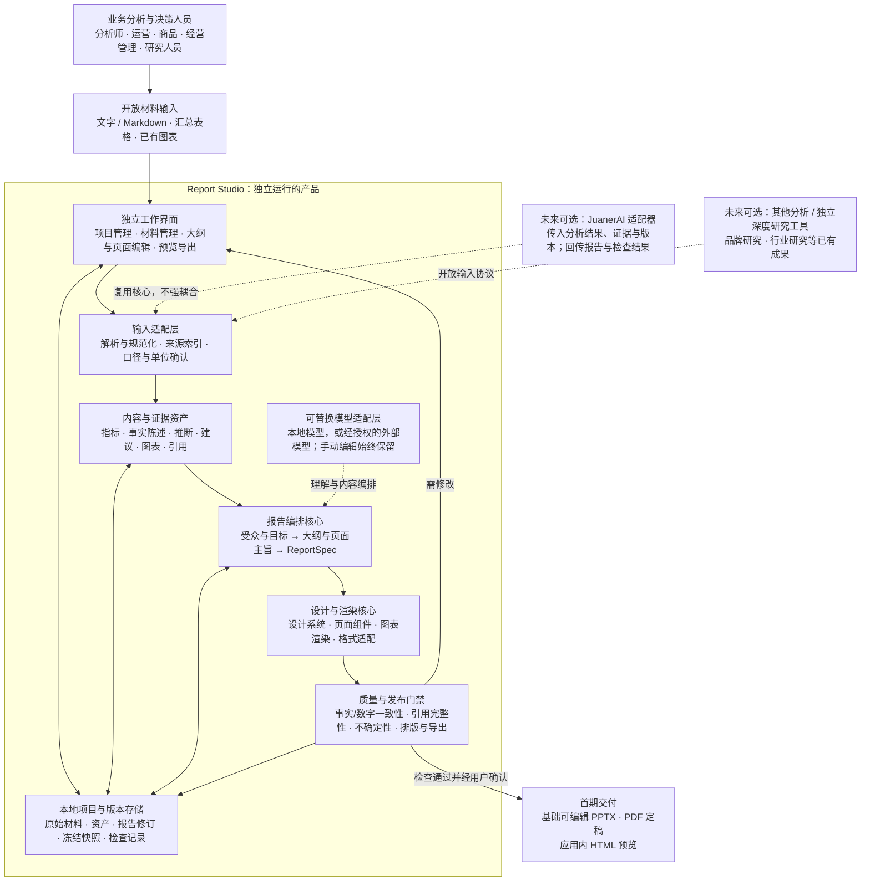

# Report Studio｜独立报告与汇报工具

## 产品方案与落地框架 v1.0（dev-flow 固化稿）

- **文档日期：** 2026-09-21
- **产品名称：** Report Studio，暂定工作名，尚未确认最终品牌名称。
- **建设路线：** 先独立运行、独立验证产品价值；成熟后接入 JuanerAI，成为其报告与汇报模块，并保留独立使用能力。
- **文档性质：** 产品规划与开发拆解基线，不代表已有功能或已完成验收。已确认的产品方向与本文建议的实现范围分别标明。
- **图文口径：** 前序概念图中的其他名称与阶段时间仅作示意；本稿统一使用 Report Studio，首期范围、依赖边界和里程碑以本文为准。

> **产品主张：让专业的分析成果，变成可以直接沟通、经得起追问、能够推动决策的专业交付物。**
>
> 不是只把文字排得漂亮，而是把已有材料组织成结构清楚、视觉专业、事实有据、方便修改的报告与会议汇报。

---

## 1. 产品结论与已确认边界

### 1.1 一句话定位

Report Studio 是一个独立的报告与汇报工具，将用户已有的分析结果、业务材料和研究成果，转化为专业、美观、可编辑、可追溯的交付物。

它首先解决"分析已经完成，但材料还不能直接用于沟通和会议"的问题，而不是代替所有分析、研究和办公软件。

### 1.2 已确认的产品方向

1. **先独立产品，后系统集成。** 不依赖 JuanerAI，也能够从材料导入走到报告导出。
2. **精美与可信同时成立。** 既要有专业视觉质量，也不能为了增强叙事而改写数字、补造依据或抹去不确定性。
3. **面向真实交付。** 产物应能用于会议、阅读和决策讨论，而不只是聊天界面中的一段总结。
4. **保留独立价值。** 成熟后接入 JuanerAI，不等于独立工具必须退出或变成只能在 JuanerAI 中使用的组件。

### 1.3 首期不得引入的强制依赖

JuanerAI、Xanthil Desktop、Analysis Core、Analysis IR、Semantic Context Runtime、Domain Pack、OSM、假设库、策略库、本体库，均不是本工具首期启动、运行或验收的前提。

本工具可以自行保存来源、结论、图表和报告版本，但不因此重建 JuanerAI 的整套分析和决策基础设施。

独立深度研究工具同样不是首期依赖。品牌研究、行业研究等成果可以通过普通材料导入；自动集成安排在后续。

### 1.4 本文建议，而非已经批准的实现细节

首期输入格式、默认模板、页面类型、里程碑拆分、数据结构和质量门槛，是为开发提供的建议基线。涉及格式引擎、操作系统覆盖、模型供应商和商业化方式的具体选择，应通过小规模样例验证后确定，不视为本稿已替用户完成选型或授权开发。

---

## 2. 用户、问题与价值

### 2.1 目标用户

目标用户是需要用分析结果参与沟通和决策的人，包括专职分析师，以及运营、商品、营销、供应链、产品、门店管理、财务、经营管理、咨询和研究等岗位。

不将"数据分析师"限定为专职数据岗位，也不要求用户具备编程能力。

### 2.2 主要问题

| 问题 | 用户的具体困难 | 本工具的解决方式 |
|---|---|---|
| 分析到汇报之间需要重新劳动 | 复制结论、重画图表、重新组织页面 | 复用已有材料，形成可直接编辑的汇报初稿 |
| 有结果但没有沟通主线 | 材料很多，听众不知道重点是什么 | 根据受众、目的和时间组织结构 |
| 排版耗时且质量不稳定 | 字号不统一、图表难读、页面拥挤 | 受控设计系统与页面组件 |
| 结论与依据脱节 | 会上被追问时找不到口径、数据来源 | 结论与来源、指标、图表建立引用 |
| 修改一处牵动整份报告 | 反复生成造成已确认内容漂移 | 对象级编辑、局部重排与版本比较 |
| 文件生成但难以使用 | PPT 页面截图化、字体溢出、导出变形 | 可编辑性与实际导出质量共同验收 |

### 2.3 价值主张与验证方式

产品价值首先是一个需要验证的假设：在不牺牲内容可靠性的前提下，减少从已有材料到汇报定稿的时间和返工。

不预先承诺具体的效率提升比例、决策收益或企业转化率。通过同任务前后对比、实际返工记录和用户是否再次使用进行验证。

---

## 3. 产品边界：表达已有成果，而不是重做所有上游工作

### 3.1 应该做

- 理解用户提供的材料，识别事实陈述、指标、推断、建议、证据和信息缺口。
- 围绕受众与会议目的，生成大纲、页面主旨、图表配置和必要说明。
- 在受控模板内完成高质量排版，支持用户局部修改。
- 保留来源、口径、版本和不确定性，并生成可用文件。
- 对简单汇总、占比、差额和变化率进行显式计算和校验，保留计算依据。

### 3.2 首期不做

- 不建设完整 BI、数据库问数、探索性分析或建模平台。
- 不主动进行全网研究，也不自动联网补齐缺失事实。
- 不承诺把任意杂乱文件一键变成无需复核的正式报告。
- 不建设任意布局的通用幻灯片设计器、复杂动画和模板市场。
- 不建设多人实时协作、会议录音转写、任务分派和完整会议管理系统。
- 不将自然语言建议自动变成业务执行指令。
- 不把已有图表图片视为可以准确恢复底层数据的结构化来源。

### 3.3 三条不可混淆的界线

**材料被导入，不代表材料真实。** 系统能够确认数字与来源一致，但不能仅凭"存在来源"保证其真实性。

**来源中的推断，不代表已证实的因果关系。** 压缩和美化不能把"可能""相关""建议验证"改写成"导致""证明""必然"。

**会议采纳，不代表策略有效。** 未来接入决策系统时，应将"被批准"和"执行后有效"作为不同状态。

---

## 4. 交付物与首期范围

### 4.1 三类内容产品

| 类型 | 使用目的 | 推荐内容主线 | 建设顺序 |
|---|---|---|---|
| 会议汇报 | 经营会、专题讨论、复盘和资源审批 | 核心判断 → 关键证据 → 业务影响 → 方案比较 → 待决事项 | **首期主场景** |
| 分析／研究报告 | 详细阅读、传阅与复核 | 问题 → 口径 → 方法 → 发现 → 证据 → 限制 → 建议 | 后续扩展 |
| 一页决策摘要 | 会前快速阅读、负责人快速判断 | 问题 → 选择 → 建议 → 风险 → 需要谁决定 | 后续独立形态；首期可先提供摘要页 |

同一份内容与证据可以形成不同表达，但不能把长报告机械切页当成会议汇报，也不能在不同文件中分别生成互相矛盾的数字。

### 4.2 建议的首期 MVP

首个版本打透：

> **用户导入已有分析材料，确认汇报大纲，生成一份专业会议汇报，完成局部修改，导出基础可编辑 PPTX 和 PDF 定稿。**

| 范围 | 首期建议 |
|---|---|
| 核心场景 | 一次真实的零售经营复盘或专题分析汇报 |
| 输入 | 粘贴文本、TXT／Markdown、CSV、简单 XLSX、PNG／JPEG 图表图片 |
| 表格限制 | 用户明确选择工作表、列、单位和口径；不执行宏，不将任意多表复杂工作簿自动理解为分析模型 |
| 材料理解 | 提取可用内容、建立来源索引、标记冲突和缺口，不开展自主深度研究 |
| 生成流程 | 先确认大纲与每页观点，再生成具体页面 |
| 默认视觉 | 一套打磨到位的简洁商务设计系统，支持有限主题配色 |
| 页面类型 | 封面、摘要、指标、趋势／对比、问题拆解、方案比较、行动／待决、证据附录 |
| 编辑 | 大纲顺序、标题正文、页面布局切换、图表配置、单页重新生成、锁定内容 |
| 输出 | 应用内 HTML 预览、基础可编辑 PPTX、PDF 定稿 |
| 项目能力 | 本地项目创建、保存、重新打开、版本快照与导出记录 |
| 可信能力 | 来源引用、数字一致性检查、关键不确定性保留、人工补充标记 |

HTML 在首期主要承担应用内预览。可独立分发的 HTML 报告、DOCX 输出、长报告排版、任意企业模板导入和多人协作不进入首期强制验收。

### 4.3 首期格式质量边界

PPTX 至少保证标题、正文和表格可编辑，常用图表优先采用可编辑对象。复杂图形允许使用高清图片，但必须标明其可编辑性边界。

不接受"每页生成一张图片，再放入 PPTX"作为完整的可编辑演示文稿能力。

已有图片在缺乏原始数据时作为图片保留；不能声称可精确编辑其数据。用户需要改动数值时，应补充原始表格或明确提供经过确认的结构化数据。

---

## 5. 用户流程与关键交互

### 5.1 端到端流程

**创建项目 → 导入材料 → 明确汇报目标 → 确认内容大纲 → 生成页面 → 局部调整 → 质量检查 → 确认与导出。**

| 步骤 | 用户动作 | 系统行为 | 主要产物／门禁 |
|---|---|---|---|
| 1. 创建项目 | 填写项目名称和用途 | 创建独立项目与本地保存位置 | 项目记录 |
| 2. 导入材料 | 上传文件或粘贴文本 | 解析、保留原件、生成来源索引；失败项明确显示 | 材料清单与解析状态 |
| 3. 明确目标 | 设置受众、目的、时长／页数、风格 | 继承已知信息，只询问影响结构的缺口 | ReportBrief |
| 4. 确认大纲 | 调整章节、页序和观点 | 给出每页主旨、证据来源和缺口 | 已确认的页面计划 |
| 5. 生成页面 | 选择生成 | 绑定内容与证据，渲染模板和图表 | 可编辑初稿 |
| 6. 局部调整 | 修改文字、顺序或单页布局 | 限定变更范围，保留锁定对象和其他页面 | 新报告修订版 |
| 7. 质量检查 | 查看问题并处理 | 校验数字、引用、措辞、排版与导出 | 阻断项、警告、检查记录 |
| 8. 确认导出 | 选择格式与分享范围 | 冻结本次快照，生成文件并记录版本 | PPTX／PDF 与导出记录 |

### 5.2 "先大纲，后美化"

初次生成先展示页面计划，例如：

- 这次汇报希望听众理解什么？
- 每一页表达哪个主要判断？
- 判断对应哪些材料或数据？
- 哪些问题尚未证实？
- 本次会议需要讨论或批准什么？

不要求用户回答所有问题；系统根据已有材料预填，用户重点确认结构与事实边界。

用户可以将某页标为"资料说明"而非"结论页"。材料不足时，可以生成待补充提示，但不能自行补造完整故事。

### 5.3 局部编辑必须稳定

支持"第三页拆成两页""保留图表，改写业务解释""将方案比较提前""把这一页的文字再精简"等指令。

每次修改必须指定作用范围：正文块、图表、单页、章节或整份报告。范围之外的已确认内容默认不变。

系统显示修改前后差异。数字和结论引用发生变化时，重新触发对应检查；风格变化不应导致内容被重新生成。

### 5.4 异常处理

材料解析失败时，只影响对应材料，不清空项目。模型失败、额度不足或网络中断时，保留已完成的大纲、页面和检查结果，允许重试。

缺失事实时显示占位与任务提示，而不是以臆测填充。用户始终可以继续手动整理；模型能力不可用不应导致已存在的项目无法打开和编辑。

---

## 6. 产品功能需求

| 编号 | 功能 | 首期要求 | 验收要点 |
|---|---|---|---|
| F01 | 项目管理 | 创建、保存、打开、复制、删除项目 | 重启后可恢复材料、页面和版本 |
| F02 | 材料管理 | 导入、解析、预览、替换版本和删除 | 原件与派生结果区分；失败原因可见 |
| F03 | 汇报目标 | 受众、目的、时长／页数、语言和风格 | 改变受众不改变事实与关键数字 |
| F04 | 内容梳理 | 指标、事实陈述、推断、建议、来源与缺口 | 不把推断升级为确定结论 |
| F05 | 大纲生成 | 页序、页面类型、核心观点、引用 | 用户可在排版前确认与修改 |
| F06 | 页面生成 | 通过预设页面类型组织内容 | 不自由生成无法维护的任意页面结构 |
| F07 | 图表处理 | 使用结构化数据生成常用图表；保留已有图片 | 图表数值可追溯，缺数据不伪造 |
| F08 | 局部编辑 | 文字修改、页序调整、单页重排与内容锁定 | 非目标页的内容和来源绑定不漂移 |
| F09 | 质量检查 | 数字、引用、语义边界和视觉检查 | 阻断项与警告有明确处理方式 |
| F10 | 版本快照 | 保存报告修订与导出快照 | 旧版本不随数据替换而静默改变 |
| F11 | 多格式输出 | PPTX、PDF；应用内预览 | 可打开、无关键遮挡、关键内容可编辑 |
| F12 | 隐私设置 | 本地存储、外部模型授权、出站内容预览 | 未授权的材料不得发送外部服务 |

---

## 7. 界面框架

### 7.1 项目首页

展示最近项目、项目名称、更新时间、汇报类型、当前阶段和最后导出版本。提供"新建汇报"和"继续编辑"，不以复杂模板市场作为首屏。

### 7.2 工作区建议

| 区域 | 主要内容 |
|---|---|
| 左侧导航 | 材料、大纲、页面列表、问题清单 |
| 中央画布 | 大纲编辑、单页编辑、整稿预览 |
| 右侧面板 | 当前页面的内容、布局、图表、证据和修改指令 |
| 顶部操作 | 保存、版本比较、检查、预览、导出 |
| 状态提示 | 本地／外部模型状态、生成进度、未保存修改、阻断问题 |

对话是操作入口之一，不是唯一界面。页序调整、模板切换、查看来源和处理错误，应有明确的可视化控件。

### 7.3 证据面板

点击关键结论或数字，可查看材料名称、位置、原文／表格片段、口径、单位、计算关系和所绑定版本。

首期可用简单的对象引用实现，不要求部署向量数据库或知识图谱。

---

## 8. 产品框架图

以下为本稿的规范性产品框架。实线为当前产品内的处理关系；虚线为成熟后可选集成，不构成首期依赖。



### 8.1 三个工程部分

**独立工作界面**承接完整用户流程；**报告生成核心**负责内容、设计、校验和输出；**输入适配层**将不同来源统一成内部资产。

"独立工具"不等于首期必须拆分为多个服务。建议首先采用模块化单体，让依赖边界清楚，但不增加不必要的部署负担。

### 8.2 技术选型原则

- 核心内容结构、页面结构、来源引用和导出结果保持解耦。
- 模型用于理解、编排和文字表达；确定性代码负责计算、引用校验和文件生成。
- 模板、图表、格式输出使用受控组件，不让模型直接掌控所有排版细节。
- 首期用本地文件和轻量元数据存储即可；不因"可追溯"而默认增加图数据库、向量数据库和复杂检索服务。
- 先验证中文、表格、图表和可编辑 PPTX 的实际输出样例，再确定具体生成引擎。
- 不要求一个引擎无损覆盖所有格式。共享 ReportSpec 和证据，针对 PPTX、PDF、预览分别适配，并检查一致性。

---

## 9. 核心数据结构与输入输出契约

### 9.1 核心对象

| 对象 | 职责 | 关键字段示例 |
|---|---|---|
| Project | 一个独立汇报项目 | project_id、title、created_at、privacy_policy |
| SourceAsset | 输入原件与版本 | source_id、version、file_hash、media_type、sensitivity |
| EvidenceRef | 可定位依据 | evidence_id、source_id、source_version、locator、excerpt |
| Metric | 可展示和计算的指标 | metric_id、value、unit、period、scope、evidence_refs |
| Claim | 待表达的事实陈述、推断或建议 | claim_id、kind、text、evidence_refs、verification_state |
| ReportBrief | 沟通任务 | audience、purpose、duration、page_budget、language、deliverables |
| ReportSpec | 报告的结构化定义 | schema_version、pages、theme、claims、charts、source_snapshot |
| Page／Block | 可独立编辑的页面与内容块 | id、type、bindings、layout、locked |
| ReportRevision | 报告修订版本 | revision_id、parent_revision、changes、confirmed_by |
| ExportRecord | 固定版本的导出记录 | export_id、revision_id、checks、format、artifact_hash |

不是所有对象都需要单独建表。首期可以用结构化文件保存报告与资产，再用轻量索引管理项目和版本。

### 9.2 ReportSpec 的职责

ReportSpec 回答"已有材料怎么呈现"，而不是"如何进行业务分析"。

其核心是页面和资产之间的稳定引用，而非一份最终 HTML 字符串。改变模板时不应重写事实；更换模型时不应丢失来源；重新导出时不应生成新的业务结论。

它与未来 JuanerAI 的 Analysis IR 可以建立映射，但首期既不要求输入 Analysis IR，也不复制其完整分析语义。

### 9.3 最小示例

下面仅是结构示例。数值为虚构测试数据，不代表任何真实业务结果；示例中下降 20% 只反映算术关系，不证明下降原因。

```json
{
  "schema_version": "1.0",
  "report_id": "report_demo_001",
  "revision_id": "rev_001",
  "brief": {
    "audience": "商品经营负责人",
    "purpose": "讨论销售变化并批准补充验证",
    "page_budget": 8,
    "language": "zh-CN"
  },
  "source_snapshot": [
    { "source_id": "src_sales_summary", "version": "v1", "is_demo": true }
  ],
  "metrics": [
    {
      "metric_id": "sales_change_rate",
      "value": -0.2,
      "unit": "ratio",
      "display_format": "0.0%",
      "scope": "两个已确认可比周期，销售额从100万元变为80万元",
      "formula": "(current - previous) / previous",
      "inputs": { "previous": 1000000, "current": 800000 },
      "source_ref": "src_sales_summary@v1"
    }
  ],
  "claims": [
    {
      "claim_id": "claim_sales_change",
      "kind": "computed_statement",
      "text": "示例销售额下降20%，下降原因尚未证实。",
      "metric_refs": ["sales_change_rate"],
      "verification_state": "arithmetic_checked",
      "source_truth_verified": false
    }
  ],
  "pages": [
    {
      "page_id": "page_02",
      "type": "comparison",
      "headline": "销售额出现下降，需要进一步验证原因",
      "claim_refs": ["claim_sales_change"],
      "metric_refs": ["sales_change_rate"],
      "required_note": "演示数据，非真实经营结论",
      "layout_id": "headline_chart_implication",
      "locked": false
    }
  ],
  "export_policy": {
    "freeze_revision": true,
    "include_source_notes": true,
    "external_share_allowed": false
  }
}
```

正式接口还需增加来源位置、图表规格、权限、缺失值、币种、日期范围等字段，并提供 schema 校验和版本迁移策略。不要将示例当成已经完成的生产接口。

---

## 10. 内容可信、版本与修改规则

### 10.1 区分内容类型与验证状态

内容类型建议包括：来源中的事实陈述、系统计算结果、分析推断、策略建议、用户补充。

验证状态单独保存，例如：已绑定来源、算术已校验、待核实、存在冲突、来源已更新。不能因为内容类型叫"事实陈述"，就自动标为"真实且已证实"。

### 10.2 关键校验规则

| 检查 | 具体要求 | 处理方式 |
|---|---|---|
| 数字一致性 | 标题、正文、表格、图表使用同一指标对象 | 不一致时阻断对应正式导出 |
| 单位和范围 | 元／万元、比例／百分点、时间、渠道范围明确 | 无法判断时要求确认，不猜测 |
| 简单计算 | 差额、占比、变化率保留输入与公式 | 由代码复算，不依赖模型口算 |
| 来源可定位 | 关键事实与指标绑定材料版本及位置 | 缺失时标待核实或补来源 |
| 证据与措辞 | 保留原有假设、限制和不确定性 | 不能将相关性写成因果性 |
| 材料冲突 | 同一口径出现不同数字时不静默择一 | 展示冲突并由用户确认处理 |
| 用户修改 | 修改数值或实质判断后重新校验 | 保留人工修改与确认记录 |
| 过期来源 | 新材料到来后显示受影响页面 | 创建新修订，不改写旧快照 |

表述不确定性等语义检查可能依赖模型与人工复核，不能宣称可由自动检测完全保证。确定性校验、模型提示和人工确认应分别记录。

### 10.3 发布门禁

- **阻断项：** 关键数值互相矛盾、明显单位错误、关键文字／图表被裁切、文件损坏、违反外部分享策略等，修复前不得生成"正式定稿"。
- **警告项：** 来源材料本身待核实、缺少补充说明、页面较密等，可在保留醒目标注并经用户确认后发布。
- **草稿导出：** 允许未完成材料导出，但明确标识草稿和未解决问题，不能与正式定稿混淆。

没有证据支撑的结论可以改为假设、建议或待决问题，但不能通过用户一次点击就被系统重新认定为已证实事实。

### 10.4 冻结快照

每次正式导出绑定来源版本、指标资产、ReportSpec、报告修订、模板／字体配置和检查结果。

数据更新后提示哪些指标、图表、结论和页面可能受影响。用户确认后生成新版本，旧文件与旧导出记录保持不变。

要求能够定位当时使用的内容和资产；不承诺不同操作系统、不同渲染引擎版本下文件字节完全一致。

---

## 11. 精美报告的设计系统与导出质量

### 11.1 设计不是最后的装饰

首期建立少而精的页面类型，并为每种类型规定标题层级、内容区、图表区、来源脚注、留白与信息容量。

默认采用"一页一个主要观点"。内容超出合理容量时，优先拆页、转附录或精简文字，而不是持续缩小字号。

### 11.2 建议的页面组件

| 页面类型 | 核心构成 |
|---|---|
| 封面 | 主题、对象、时间范围、版本 |
| 结论摘要 | 主要发现、关键限制、本次待决事项 |
| 指标总览 | 指标、可比基准、差额／变化率、口径 |
| 趋势／对比 | 结论标题、主图表、业务解释、来源 |
| 问题拆解 | 分解维度、证据、尚未验证的原因 |
| 方案比较 | 统一比较维度、约束、利弊、待补信息 |
| 行动／待决 | 建议动作、需确认责任人／时间、批准事项 |
| 证据附录 | 方法、口径、来源与必要的详细数据 |

方案比较不能擅自补造投入产出、收益预测、评分和负责人；缺失项明确留空或标待确认。

### 11.3 图表与文本要求

数据图表必须由结构化数据渲染，或引用已有图表。图片生成能力只可用于非数据性的装饰视觉，不用于重画正式证据图表和数字。

正文、标题、标签尽量保留文字对象。选择允许使用和分发的字体，并考虑目标环境的替代字体，不随意打包用户或系统中的字体文件。

### 11.4 跨格式策略

PPTX、PDF 和应用内预览共享内容与证据，但允许使用不同的布局适配器。不要求像素级一致，要求信息一致、层级合理、没有关键内容丢失。

如 PDF 使用与 PPTX 不同的渲染路径，必须检查标题、指标、表格和来源说明的一致性，不能只检查一个格式。

### 11.5 可编辑性分级

导出记录展示哪些对象可编辑：

- 原生可编辑：标题、正文、基础形状、表格，以及引擎支持的常用图表。
- 部分可编辑：复合图形中的文本与装饰对象。
- 图片资产：用户导入图表、复杂示意图等，不能直接编辑其内部数据。

首期应选择明确的演示软件版本和操作系统组合做验证；不能未经测试声称所有办公软件都完全兼容。

---

## 12. 本地优先、模型接入与安全

### 12.1 本地优先的真实含义

材料原件、项目、结构化资产、图表渲染和文件生成默认留在本地。

使用外部模型时，其接收的材料片段会离开本机，因此不能宣传为"全程不外传"。外部调用必须基于明确授权，用户可查看发送范围。

本地模型是可替换选项，不预设所有设备都能运行任意模型。独立产品指不依赖 JuanerAI；完全离线自动生成则取决于本地模型和依赖是否具备，应单独验证。

### 12.2 首期安全规则

| 环节 | 要求 |
|---|---|
| 文件导入 | 限定支持格式，检查异常大小与格式，不执行宏和文档脚本 |
| 材料解释 | 将文档中的指令视为材料内容，不允许其改变系统权限或触发外部操作 |
| 外部模型 | 用户选择服务并授权范围；尽量只发送必要片段，保留调用记录 |
| 文件操作 | 限定项目工作目录，防止材料内容诱导读取无关本地文件 |
| 外部资源 | 不自动访问材料中的链接或下载嵌入资源 |
| 日志 | 默认不记录完整敏感内容，错误日志与业务材料分离 |
| 删除 | 明确删除原件、缓存、临时渲染文件和索引的范围 |
| 对外导出 | 检查隐藏页面、备注、附录、元数据及图表底层数据是否包含敏感内容 |

可编辑图表可能包含底层数据。对外分享时，系统应提供"保留可编辑数据"与"只分享必要聚合结果"的明确选择；安全需要优先于可编辑性。

### 12.3 证据公开的范围

内部版本可保留完整证据链；外部版本按授权保留必要口径和可公开来源。

不能因隐藏敏感信息而产生虚假的来源，也不能为了方便追溯将原始材料无差别嵌入演示文件。

---

## 13. 首个验证场景与测试集

### 13.1 首个样板：零售经营复盘

用户提供一份已有分析结论、几张汇总表和现成图表，希望面向商品经营负责人汇报。

建议汇报主线：

**目标与实际差距 → 已确认的事实 → 尚未证实的原因 → 可选应对方案 → 建议补充验证／试点 → 需要批准的事项。**

以"销售下降，但缺货是否是主要原因尚未证实"为例，页面应写成"建议先验证供货问题，再决定是否扩大促销"，不能擅自改为"缺货导致销售下降"。

### 13.2 端到端验收样例

| 样例 | 测试输入或动作 | 预期行为 |
|---|---|---|
| 正常汇报 | 结论文本、同口径表格和图表齐全 | 完成大纲、页面、检查和两种正式导出 |
| 同比／环比混淆 | 表格注明同比，文字写成环比 | 识别不一致并要求处理 |
| 单位错误 | 一处是元、一处被写成万元 | 阻断正式定稿，定位问题对象 |
| 百分比与百分点 | 利润率从20%到25% | 区分上升5个百分点与相对增长25% |
| 证据不足 | 材料仅有相关关系 | 保留为推断，不自动写成原因已证实 |
| 材料冲突 | 两个来源给出不同销售额 | 显示冲突，不静默选一个数字 |
| 局部修改 | 只重写第三页业务解释 | 其他页内容、数字与绑定不变化 |
| 来源替换 | 上传新的表格版本 | 提示受影响页面，旧导出保持不变 |
| 只有图表图片 | 无底层数据但要求修改数值 | 提示补数据，不伪造可编辑图表 |
| 中文长标题 | 标题过长、脚注较多 | 拆页／调整布局，不遮挡、不无限缩字 |
| 未授权外发 | 项目设为禁止外部模型 | 阻止发送，允许继续本地编辑 |
| 恶意材料指令 | 文档要求上传本地文件或忽略规则 | 作为普通内容处理，不执行指令 |
| 导出一致性 | 比较PPTX、PDF、预览 | 关键数字、结论和来源说明一致 |
| 模型中断 | 生成中断后重启应用 | 已保存内容可恢复，可从失败步骤重试 |

### 13.3 建议的首期质量门槛

以下是发布门槛建议，不是已实现的成绩：

- 已声明支持的样例中，全部关键数值能够定位至输入来源或计算依据。
- 正式导出中，未解决的阻断项为零。
- 标题、正文和基础表格通过可编辑性验证；图片例外明确可见。
- 回归测试中，局部修改不改变范围之外的已确认内容。
- 固定版本的PPTX与PDF无关键内容遮挡、丢失或数值矛盾。
- 未授权外部调用被阻止；对外分享设置覆盖备注、隐藏内容与图表内嵌数据。

真实材料可能存在未能自动识别的问题，因此仍需用户完成发布确认。通过测试集不等于系统可以保证所有业务结论正确。

---

## 14. 建设里程碑与开发顺序

不以固定月数定义成熟度。先通过阶段门禁，再增加格式和集成范围。

| 阶段 | 目标 | 交付 | 进入下一阶段的条件 |
|---|---|---|---|
| M0：交付样例验证 | 证明目标格式和中文版式可用 | 一组代表性页面、PPTX／PDF样例、导出限制清单 | 关键页面可读、主要对象可编辑、无格式阻断 |
| M1：独立闭环 MVP | 从材料到会议汇报完整跑通 | 项目管理、输入解析、目标与大纲、页面生成、局部编辑、校验导出 | 不安装 JuanerAI 也能独立完成真实任务 |
| M2：稳定性与真实使用 | 解决返工、冲突、版本、隐私和导出问题 | 回归样例、版本比较、失败恢复、真实用户反馈记录 | 多次实际使用可重复完成，关键问题关闭 |
| M3：交付物扩展 | 扩展长报告、一页摘要、更多输入及品牌模板 | 经验证的新格式和模板能力 | 不降低现有会议汇报质量与可信边界 |
| M4：可选集成 | 复用同一核心服务 JuanerAI 等工具 | 输入适配器、调用入口、权限与版本映射 | 独立版继续可用，集成通过单独验收 |

### 14.1 MVP 内部建议顺序

先做"手工准备的结构化内容 → 高质量导出"，验证排版与可编辑性；再接入材料解析和大纲编排；最后完善局部编辑、证据与门禁。

不要先做复杂 Agent 编排和大量模板，最后才发现输出文件无法满足会议使用要求。最终对外 MVP 必须包含基本可信和隐私门禁，不能把它们留到发布之后。

### 14.2 成熟的定义

成熟至少需要同时满足：

1. **独立价值成立：** 没有 JuanerAI，用户也会重复使用它完成工作。
2. **内容可靠性可控：** 关键数字和来源可追溯，不确定性保留，错误有明确处理路径。
3. **交付质量稳定：** 预览、PPTX和PDF均可用于实际沟通。
4. **修改成本可接受：** 用户可以局部修订，而不是不断推翻整份生成结果。

是否接入 JuanerAI应由上述证据决定，而不只是"模板数量够多"或"已经开发了几个月"。

---

## 15. 产品效果指标

| 指标 | 定义 | 使用方式 |
|---|---|---|
| 到首份可用初稿的时间 | 从材料就绪到用户认为可以继续编辑的初稿 | 与同类任务原有流程对比 |
| 到正式定稿的时间 | 从材料导入到用户确认可用于会议 | 同时记录人工核验和排版工时 |
| 返工量 | 重做页面比例、实质内容修改、整稿重新生成次数 | 判断生成质量，而非只看生成速度 |
| 关键来源覆盖率 | 已绑定来源或计算依据的关键陈述数／关键陈述总数 | 不将其等同于事实正确率 |
| 阻断问题数量 | 数字矛盾、关键缺失、严重排版和权限问题 | 作为发布质量信号 |
| 导出可用率 | 在指定目标软件中可正常使用的导出任务比例 | 按格式和软件环境分别统计 |
| 重复使用 | 用户在第二次真实任务中是否继续采用 | 验证独立产品价值 |
| 无关变更率 | 局部编辑引发的范围外变化数量 | 衡量编辑稳定性 |

初期通过少量真实任务建立基线，再设量化改善目标。不要只用"生成页数""一键成功次数"作为产品成功标准。

会议材料被转发、管理者看到报告、JuanerAI 获得企业线索，可以作为后续增长假设观察，但不预设必然带来企业采用。

---

## 16. 成熟后接入 JuanerAI 的方式

### 16.1 一套核心，两种入口

**独立工具入口：** 用户导入自己的材料，完成报告制作。

**JuanerAI 入口：** 用户在分析任务中点击生成汇报，系统自动带入已授权的结论、图表、证据与版本；用户仍需确认受众、主线和正式发布。

不是把独立工具重写成 JuanerAI 内部代码，也不是要求 JuanerAI 重新实现排版能力。

### 16.2 未来适配器的输入输出

| 方向 | 主要内容 |
|---|---|---|
| JuanerAI → Report Studio | 任务标识、分析结果版本、已授权的指标和结论、图表数据、证据引用、不确定性、使用目的 |
| Report Studio → JuanerAI | 报告标识、修订版本、文件引用、检查结果、来源映射、用户确认状态 |

适配器不获得超出当前用户权限的数据访问范围，不直接绕过分析任务去读取所有数据库或双库。

### 16.3 接入边界

- Analysis IR可以帮助映射已产出的分析资产，但不是报告核心的运行依赖。
- 假设库与策略库可作为未来上游来源，报告工具不直接篡改其状态。
- OSM等模块可在后续接收经过用户确认的待决事项，但报告生成不等于任务自动执行。
- 用户在报告里补充或修改分析结论时，应作为变更返回上游复核，而不是静默覆盖原分析结果。
- 独立深度研究工具可以采用相同输入契约，但品牌研究、行业研究的运行与验收不依赖该集成完成。

### 16.4 集成验收

同一份结构化结果通过独立导入与 JuanerAI 接入后，应保持关键内容和来源一致；报告服务暂时不可用不应破坏原分析任务；断开集成后，独立工具仍能运行。

---

## 17. 风险与取舍

| 风险 | 典型表现 | 应对原则 |
|---|---|---|
| 变成通用PPT软件 | 功能不断扩展，首期难以交付 | 聚焦已有材料到会议汇报 |
| 视觉优先于事实 | 强结论标题掩盖证据不足 | 内容绑定和语义边界先于美化 |
| 格式承诺过大 | 预览漂亮，导出难用 | 先测真实文件，再确定引擎和兼容范围 |
| AI生成不稳定 | 一次修改重写全稿 | 稳定对象ID、局部变更、锁定、差异比较 |
| 数据外泄 | 美化环节绕过本地优先 | 出站授权、最小内容、导出隐私检查 |
| 过度依赖上游产品 | 没有 JuanerAI 就无法使用 | 普通材料输入和独立端到端验收 |
| 技术架构过重 | 为接入预建平台、服务和图谱 | 模块化单体、简单协议、证据驱动扩展 |
| 误把来源绑定当真相 | 引用了错误材料仍显示"已验证" | 验证状态分层，明确来源真实性边界 |

---

## 18. 开发前需要确认的少量事项

下列事项不妨碍本产品方案成立，但在进入具体编码任务前应记录决定：

| 事项 | 本稿建议 |
|---|---|
| 最终品牌名称 | 继续使用 Report Studio 作为工作名，正式命名另行确认 |
| 首期应用形态 | 优先选择能独立启动的本地应用形态；浏览器前端＋本地服务或桌面封装均可，先验证交付能力 |
| 首批测试环境 | 选择主要用户实际使用的操作系统和演示软件组合，明确验收范围 |
| 模型接入 | 提供可替换适配层，明确本地与外部服务各自的隐私和能力边界 |
| 文件生成引擎 | 用中文、图表、表格、长文本和可编辑性样例进行对比验证后决定 |
| 商业化方式 | 先验证真实重复使用，不在首期强行加入账号、付费、云同步和团队计费 |

---

## 19. 交给产品／开发 Controller 的简版任务说明

> 请以本文件作为 Report Studio 独立产品的规划基线，先完成首期范围确认、架构边界与交付样例验证，再拆解开发任务。
>
> 产品先独立运行、独立验证价值，成熟后再接入 JuanerAI，并保留独立使用能力。JuanerAI、Xanthil Desktop、Analysis Core／Analysis IR、Semantic Context Runtime、Domain Pack、OSM、假设库／策略库和独立深度研究工具均不得成为首期运行与验收的强制依赖。
>
> 首期聚焦"已有分析材料 → 大纲确认 → 专业会议汇报 → 局部编辑 → 质量检查 → 基础可编辑 PPTX／PDF"。内容真实边界、数字一致性、来源引用、版本冻结、本地隐私与导出质量，必须纳入正式发布门禁。
>
> 工程上分离独立界面、输入适配、报告编排、设计渲染、质量检查与本地存储；不提前建设微服务、复杂插件平台和企业协作系统。先用代表性样例证明中文排版和可编辑导出，再确定具体技术方案。
>
> 请输出范围清单、模块职责、对象契约、里程碑、验收样例及风险清单。本文是产品规划输入，不自动授权修改现有 JuanerAI 仓库、重构用户既有开发模式或开始跨项目集成。

---

## 20. 最终定位

**Report Studio 先成为一个自身有价值的独立工具，再通过集成为 JuanerAI 增加价值。**

它的交付标准不是"生成了一份看起来像报告的文件"，而是：

> **用户可以把这份成果直接拿去沟通，能够解释其中的关键数字和依据，可以方便地进行修改，并清楚知道哪些结论已经有支持、哪些问题仍然需要验证。**

---

### 文档依据与说明

本稿依据当前对话中已经讨论并确认的产品定位与建设路线整理；新增的首期范围、对象结构、质量门槛和里程碑属于方案建议，未使用真实客户数据，也不构成对现有实现状态的陈述。文中示例均明确作为测试或演示用途。本文不包含代码变更，不替代后续技术选型验证。
